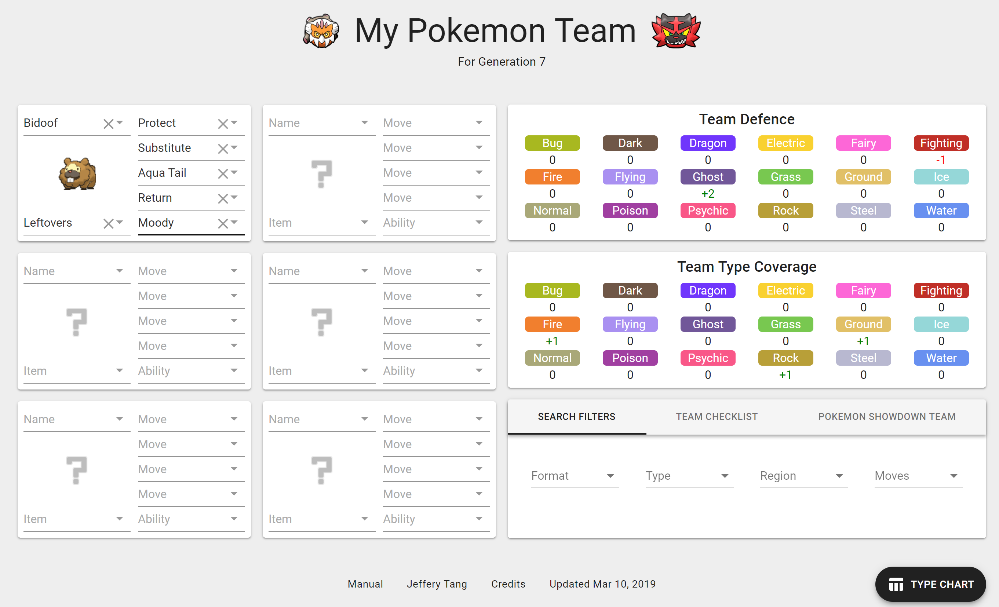

# [My Pokemon Team](https://mypokemonteam.com)
### The Ultimate Pokemon Teambuilder at [mypokemonteam.com](https://mypokemonteam.com)
#### I will update the site for generation 8 when Pokemon Sword and Shield come out.

## What makes this teambuilder special?
1. You can import/export your team to Pokemon Showdown
2. It's very accurate, it takes into account special abilities (Levitate, Thick Fat, Filter, Sap Sipper, Aerilate, Wonder Guard, etc.) and moves (Freeze Dry, Flying Press, Seismic Toss, Judgment, etc.)
3. There's a team checklist.
4. The sprites are animated, which is nice

## Features to Work on
I plan on implementing these 5 things first when Pokemon Sword and Shield come out:
1. Updating the site for generation 8.
2. Rewrite bad code.
2. Setting EV, IV, and natures
3. Using your base speed, EV, and IV to determine your speed tier
4. Polishing the design of the site.

You can check out the issues tab to see what other improvements I have in mind. Or you can create a new issue if you have suggestions of your own :)

If you want to help me write code for new features, I would suggest that you save your time, because my code is messy and getting borderline unmaintainable. I'll have to rewrite all the bad code first.

## Major Credits
- [Pokemon Showdown](https://pokemonshowdown.com/): animated sprites, non-animated sprites, and all the pokemon data (thanks Zarel!)
- [Javascript React framework](https://reactjs.org/)
- [Material UI](https://material-ui.com/)
- [MobX state management](https://mobx.js.org/)
- [Google Analytics](https://support.google.com/analytics/answer/1008015?hl=en)

## Minor Credits
- [Landorus-T Face](https://archive.nyafuu.org/vp/last/50/34683395/)
- [Incineroar Face](https://thegamehaus.com/wolfe-glick-wins-sixth-regional-title-vgc-2018-charlotte-regional-championships-recap/2018/03/20/)
- [Bulbapedia's Type Chart](https://bulbapedia.bulbagarden.net/wiki/Type)
- [Non-table Type Chart](https://pinterest.ca/pin/307159637067301004/)
- [Assigning each type a color](https://guiguilegui.wordpress.com/2016/05/23/pokemon-type-classifier-using-their-colors')
- [r/stunfisk](https://reddit.com/r/stunfisk)