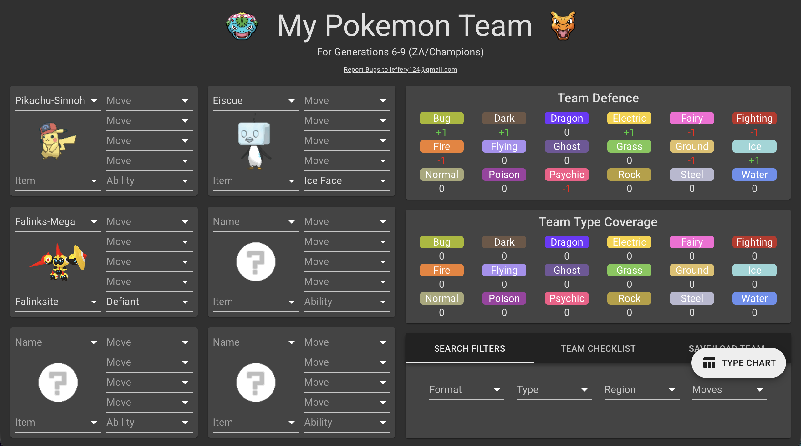

# [My Pokemon Team](https://mypokemonteam.com)

An all-purpose Pokemon teambuilder for generations 6-9, including Legends: Z-A and Pokemon Champions. Try it at [mypokemonteam.com](https://mypokemonteam.com).



## What makes this teambuilder special?

1. You can import/export your team to Pokemon Showdown, or share it as a link
2. It's very accurate: it takes into account special abilities (Levitate, Thick Fat, Filter, Sap Sipper, Aerilate, Wonder Guard, etc.) and moves (Freeze Dry, Flying Press, Seismic Toss, Judgment, etc.)
3. There's a team checklist
4. Search filters narrow down the Pokemon by format, type, region, and moves
5. The sprites are animated, which is nice

## Tech Stack

This is a single-page application with no backend. Pokemon data comes from local files in [src/data](src/data), sourced from Pokemon Showdown. The production site is hosted on Vercel at [mypokemonteam.com](https://mypokemonteam.com). Vercel deploys `master` to it once CI passes.

- UI: React and Material UI (MUI).
- Build and typechecking: Vite and TypeScript.
- Linting and formatting: ESLint and Prettier.
- State management: MobX with mobx-react-lite.
- URL handling for shared team links: React Router.
- Virtualized lists: react-window.
- Browser testing: Playwright.
- Direct rule testing: Playwright's test runner in Node, without a browser.

See [package.json](package.json) for dependency versions and the exact script definitions, and [AGENTS.md](AGENTS.md) for the code structure and conventions.

## Local Development

Use Node 24, as specified in [.nvmrc](.nvmrc). With nvm installed, set up a fresh checkout and start the app with:

```sh
nvm install
nvm use
npm ci
npm start
```

The development server runs at [localhost:3000](http://localhost:3000). `npm run dev` starts the same server.

To build the production app into `build/` and preview it locally:

```sh
npm run build
npm run preview
```

Vite preview uses port 4173 by default. It serves the existing build, so rebuild after making changes.

## Updating Pokemon Data

Refresh the Pokemon Showdown data in `src/data` with:

```sh
npm run update:data
```

This update is run manually when new data is needed. It reads the `pokemon-showdown` and `pokemon-showdown-client` repositories cloned next to this one; set `SHOWDOWN_ROOT` and `SHOWDOWN_CLIENT_ROOT` to use other locations.

Learnsets combine every generation with the games Showdown keeps in separate mods: Pokemon Champions, Legends: Z-A, Legends: Arceus, and BDSP. To include another game, add its mod to `learnsetMods` in `scripts/update-data.mjs`.

The Pokemon Champions (M-C) format filter reads eligibility from Showdown's `champions` mod, which follows the current regulation. When that mod moves to a new regulation, rename the filter to match.

The Viable moves filter comes from the Showdown client's teambuilder. The script runs the client's own `BattleMoveSearch.moveIsNotUseless` function, and a move is viable if any pokemon that learns it, with any of its abilities and required items, finds it useful in singles or doubles. If the update fails with "Could not find BattleMoveSearch.moveIsNotUseless", the client has restructured that function and `updateViableMoves` needs adjusting.

To keep the bundle small, the script only keeps the fields the app reads. To use another Showdown field, add it to `projections` in `scripts/update-data.mjs` and to the matching type in `src/types.ts`, then rerun the update.

## Testing

After setting up the project, install the Playwright browsers and run all checks:

```sh
npx playwright install --with-deps chromium webkit
npm test
```

`npm test` runs these in order, and each can be run alone:

- `npm run typecheck`: application types with `noUncheckedIndexedAccess`, including the compile-time checks in `tests/type-contracts.ts`, then test types.
- `npm run lint`: ESLint and Prettier (`npm run format` applies the formatting). Generated files in `src/data` are excluded.
- `npm run test:logic`: [direct rule tests](tests/logic/logic-tests.md) in Node, without a browser.
- `npm run test:smoke`: builds the production app and checks its essential flows with Vite preview on port 4173.
- `npm run test:dev`: browser tests of the UI against the development server on port 3000.

Both browser suites use four Playwright browser profiles. Playwright starts and stops the servers itself, except that `test:dev` reuses a development server already running on port 3000. Keep port 4173 free. Arguments after `--` go to Playwright, for example `npm run test:logic -- learnsets` or `npm run test:dev -- --project="Desktop Chrome"`.

The [CI workflow](.github/workflows/ci.yml) runs the same checks on pull requests and pushes to `master`, and keeps the Playwright reports as an artifact. To use its settings locally, run `CI=true npm test` with ports 3000 and 4173 free.

## Major Credits

- Nintendo, The Pokemon Company, Game Freak
- [Pokemon Showdown](https://pokemonshowdown.com/): animated sprites, non-animated sprites, and all the pokemon data (thanks Zarel!)
- [React](https://react.dev/)
- [Material UI](https://mui.com/material-ui/)
- [MobX state management](https://mobx.js.org/)

## Minor Credits

- [Bulbapedia's Type Chart](https://bulbapedia.bulbagarden.net/wiki/Type)
- [Non-table Type Chart](https://pinterest.ca/pin/307159637067301004/)
- [Assigning each type a color](https://guiguilegui.wordpress.com/2016/05/23/pokemon-type-classifier-using-their-colors)
- [r/stunfisk](https://reddit.com/r/stunfisk)
